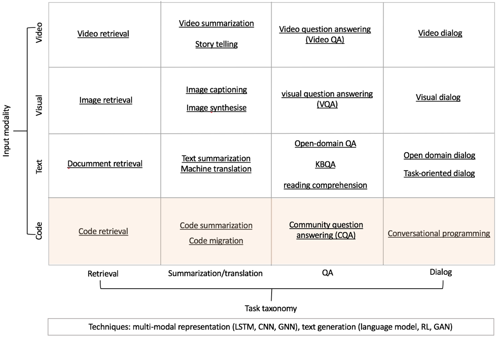

# Natural Code Reading List
This repository is for some papers I have collected for natural language processing and programming language analysis. We are trying to build the state-of-the-art on bridging the gap between natural language and programming language.

## Targeted conferences: ICML, NeurIPS, ICLR, ICSE, FSE, ASE, AAAI, IJCAI, KDD, WWW, SIGIR

## A Big Picture

## 1. Fundamental theory
### Deep Learning
- LSTM
- CNN
- Seq2Seq Framework
- Attention Mechanism
- Beam Search

### GAN
- SeqGAN - SeqGAN: Sequence Generative Adversarial Nets with Policy Gradient
- MaliGAN - Maximum-Likelihood Augmented Discrete Generative Adversarial Networks
- RankGAN - Adversarial ranking for language generation
- LeakGAN - Long Text Generation via Adversarial Training with Leaked Information
- TextGAN - Adversarial Feature Matching for Text Generation
- GSGAN - GANS for Sequences of Discrete Elements with the Gumbel-softmax Distribution

### Reinforcement Learning
- (*****) Deep Reinforcement Learning For Sequence to Sequence Models
> 常用RL方法应用在Seq2Seq中，包含Tensorflow写的源代码。

- AN ACTOR-CRITIC ALGORITHM for sequence prediction
- Actor-Critic Sequence Training for Image Captioning
- Maximum Entropy Inverse Reinforcement Learning
- (*****) Towards Diverse Text Generation with Inverse Reinforcement Learning
> IRL本质上和GAN等价，Maximum Entropy IRL是一种比较常用的IRL方法。

- Deep Reinforcement Learning-based Image Captioning with Embedding Reward
> 用drl做image captioning，写的比较好

- (*****) Reinforcement Learning and Control as Probabilistic Inference-Tutorial and Review
> 从概率图的角度对RL进行了推导。可以考虑在图模型中加入latent variable。VAE＋maximum entropy RL进行fine-grained text generation.

### Multi-Agent Reinforcement Learning
- TODO

### Transfer Learning/Meta-Learning
- (*****) Model-Agnostic Meta-Learning
> 最常用的一种meta-learning方法之一。
- A spect-augmented Adversarial Networks for Domain Adaptation

- (*****) Natural Language to Structured Query Generation via Meta-Learning
> 很好的将seq2seq的task定义成了meta-learning task.

- (*****) Learning a Prior over Intent via Meta-Inverse Reinforcement Learning
> 当expert demonstration比较少的时候很难求reward function。考虑将其它tasks里面的信息作为prior引入进来。

### Graph Neural Network

### Non-Autoregressive

## 2. Text Summarization

- A Neural Attention Model for Sentence Summarization
- A Deep Reinforced Model for Abstractive Summarization

## 3. (Visual) Q&A and Dialog
### Dialog Generation
- A Hierarchical Latent Structure for Variational Conversation Modeling
- A Hierarchical Latent Variable Encoder-Decoder Model for Generating Dialogues
- (*****) Improving Variational Encoder-Decoders in Dialogue Generation
> 以上三篇都是利用Variational Encoder-Decoders进行open domain中的dialogue generation

- (*****) DialogWAE- Multimodal Response Generation with Conditional Wasserstein Auto-Encoder
> Dialog generation, VAE+GAN, 在latent variable加入了mixture Gaussion。

- Learning Discourse-level Diversity for Neural Dialog Models using Conditional Variational Autoencoders

### QA
- Cross-Dataset Adaptation for Visual Question Answering
- Joint Image Captioning and Question Answering
- Learning Answer Embeddings for Visual Question Answering
- Question Answering through Transfer Learning from Large Fine-grained Supervision Data

### VQA (Visual Question Answering)
- (**) Visual Question Answering- A Survey of Methods and Datasets
> survey，快速了解VQA。

- (****) Visual Question Answering as a Meta Learning Task
> 首次将VQA这个task定义成了一个Meta Learning Task。

### Visual Dialog
- (**) Visual Dialog
> 快速了解VisDialog这个task。

- Learning Cooperative Visual Dialog Agents with Deep Reinforcement Learning
- (****) Are You Talking to Me-Reasoned Visual Dialog Generation through Adversarial Learning
> 用GAN做visDiag

- Two can play this Game- Visual Dialog with Discriminative Question Generation
- Zero-Shot Dialog Generation with Cross-Domain Latent Actions
- Adversarial Learning of Task-Oriented Neural Dialog Models
- Best of Both Worlds- Transferring Knowledge from Discriminative Learning to a Generative Visual Dialog Model

## 4. Program Language Processing
### Survey
- A Survey of Machine Learning for Big Code and Naturalness
> 对应网站：https://ml4code.github.io/，里面update了很多ML4Code的很多有意思的论文。

- 几个ML＋code做的比较好的组
> https://www.microsoft.com/en-us/research/project/program/
> https://ece.uwaterloo.ca/~lintan/
> https://xin-xia.github.io/
> http://www.mysmu.edu/faculty/davidlo/

### Code Representation
- LEARNING TO REPRESENT PROGRAMS WITH GRAPHS
> 除了Tree，用一种更通用的Graph来做，这样和现在比较火的图卷积也可以进行结合。

- A General Path-Based Representation for Predicting Program Properties
- Hierarchical Learning of Cross-Language Mappings through Distributed Vector Representations for Code

### Text2Code & Code2Text
- A Convolutional Attention Network for Extreme Summarization of Source Code
- AutoComment- Mining Question and Answer Sites for Automatic Comment Generation
- Automatic Comment Generation using a Neural
- Convolutional Neural Networks over Tree Structures for Programming Language Processing
> 用的Tree-CNN来represent code

- Supervised Deep Features for Software Functional Clone Detection by Exploiting Lexical and Syntactical Information in Source Code
> 用的Tree-LSTM来represent code

- Exploiting Tree Structures for Classifying Programs
> 软工领域，Tree结构用的比较好，但没有用深度学习

- Learning to Generate Pseudo-code from Source Code using Statistical Machine Translation
- Natural Language Models for Predicting Programming Comments
- SEQ2SQL/ GENERATING STRUCTURED QUERIES
- Summarizing Source Code using a Neural Attention Model
- Sequence to Sequence Learning with neural networks
- Tree-to-Sequence Attentional Neural Machine Translation

### Program Synthesis
- 还没仔细调研，但很火的一个topic，主要用到dynamic memory network等技术。
- Abstract Syntax Networks for Code Generation and Semantic Parsing
- Reinforcement Learning Neural Turing Machines

### API
- Deep API Learning
>  简单的Seq2Seq的应用，发的较早

- Exploring API Embedding for API Usages and Applications
- DeepAM- Migrate APIs with Multi-modal Sequence to Sequence Learning

## 5. Semantic Parsing
### Code generation
- A Retrieve-and-Edit Framework for Predicting Structured Outputs, Hashimoto et al., NeurIPS, 2018
- A Grammar-Based Structural CNN Decoder for Code Generation, Sun et al., AAAI, 2019
- Program Synthesis and Semantic Parsing with Learned Code Idioms, Shin et al., NeurIPS 2019
### SQL generation
- SParC Cross-Domain Semantic Parsing in Context, Yu et al., ACL 2019
- SyntaxSQLNet Syntax Tree Networks for Complex and Cross-Domain Text-to-SQL Task, Yu et al., ACL 2019
- Grammar-based Neural Text-to-SQL Generation, Lin et al., arXiv 2019
- Towards Complex Text-to-SQL in Cross-Domain Database with Intermediate Representation, Guo et al., ACL 2019
- Editing-Based SQL Query Generation for Cross-Domain Context-Dependent Questions, Zhang et al., EMNLP 2019
- Robust Text-to-SQL Generation with Execution-Guided Decoding, Wang et al., arXiv 2018
- Content Enhanced BERT-based Text-to-SQL Generation, Guo et al., arXiv 2019
### Structured generation
- Non-autoregressive Neural Machine Translation, Gu et al., ICLR 2018
- Tree-to-tree Neural Networks for Program Translation, Chen et al., NIPS 2018
- Convolutional neural networks over tree structures for programming language processing, Sun et al., AAAI 2019

### Others
- DeepFix- Fixing Common C Language Errors by Deep Learning
- Deep Reinforcement Learning for Programming Language Correction
- Neural Code Completion
- pix2code- Generating Code from a Graphical User Interface Screenshot